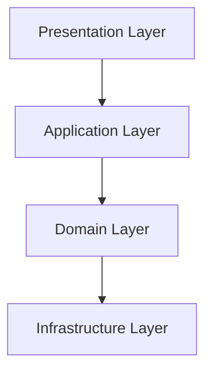
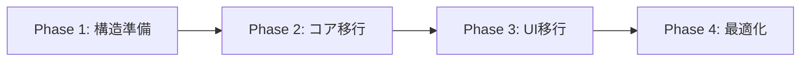

# StreamlitベースRAGアプリケーションの推奨ディレクトリ構成

## 現在のプロジェクト構造の分析

現在のCLAPPプロジェクトは以下の構造を持っています：

```
QAMP2025/
├── CLAPP.py                    # メインエントリーポイント
├── agents/                     # エージェント定義
├── components/                 # UIコンポーネント
├── config/                     # 設定ファイル
├── QAMP/                       # RAGデータとスクリプト
│   ├── data/                   # ベクトルDB
│   └── scripts/                # データ処理スクリプト
├── rag/                        # RAG検索ロジック
├── tools/                      # エージェントツール
├── utils/                      # ユーティリティ関数
└── workflows/                  # ワークフロー実装
```

## StreamlitベースRAGアプリケーションのベストプラクティス

### 1. **レイヤー分離の原則**

RAGアプリケーションは以下の4つの主要レイヤーに分けるべきです：



#### Presentation Layer（プレゼンテーション層）
- Streamlit UIコンポーネント
- ユーザーインタラクション
- 表示ロジック

#### Application Layer（アプリケーション層）
- ビジネスロジック
- ワークフロー制御
- エージェントオーケストレーション

#### Domain Layer（ドメイン層）
- RAGコアロジック
- 検索・埋め込み処理
- LLM統合

#### Infrastructure Layer（インフラストラクチャ層）
- データベース接続
- 外部API呼び出し
- ファイルシステム操作

### 2. **推奨ディレクトリ構成**

```
streamlit-rag-app/
│
├── app.py                          # メインエントリーポイント
│
├── .env                            # 環境変数（gitignore）
├── .gitignore
├── requirements.txt
├── README.md
│
├── config/                         # 設定管理
│   ├── __init__.py
│   ├── settings.py                 # アプリケーション設定
│   ├── constants.py                # 定数定義
│   └── prompts/                    # プロンプトテンプレート
│       ├── system_prompts.py
│       └── rag_prompts.py
│
├── src/                            # ソースコード
│   │
│   ├── presentation/               # UI層
│   │   ├── __init__.py
│   │   ├── components/             # 再利用可能なUIコンポーネント
│   │   │   ├── __init__.py
│   │   │   ├── chat_interface.py
│   │   │   ├── sidebar.py
│   │   │   ├── document_viewer.py
│   │   │   └── metrics_display.py
│   │   └── pages/                  # マルチページアプリの場合
│   │       ├── __init__.py
│   │       ├── home.py
│   │       └── settings.py
│   │
│   ├── application/                # アプリケーション層
│   │   ├── __init__.py
│   │   ├── workflows/              # ビジネスワークフロー
│   │   │   ├── __init__.py
│   │   │   ├── chat_workflow.py
│   │   │   └── document_workflow.py
│   │   ├── services/               # アプリケーションサービス
│   │   │   ├── __init__.py
│   │   │   ├── chat_service.py
│   │   │   └── document_service.py
│   │   └── agents/                 # エージェント定義
│   │       ├── __init__.py
│   │       ├── base_agent.py
│   │       └── rag_agent.py
│   │
│   ├── domain/                     # ドメイン層
│   │   ├── __init__.py
│   │   ├── models/                 # ドメインモデル
│   │   │   ├── __init__.py
│   │   │   ├── document.py
│   │   │   ├── query.py
│   │   │   └── response.py
│   │   ├── rag/                    # RAGコアロジック
│   │   │   ├── __init__.py
│   │   │   ├── retriever.py        # 検索ロジック
│   │   │   ├── embedder.py         # 埋め込み生成
│   │   │   ├── reranker.py         # リランキング
│   │   │   └── generator.py        # 回答生成
│   │   └── llm/                    # LLM統合
│   │       ├── __init__.py
│   │       ├── base_llm.py
│   │       ├── openai_client.py
│   │       └── gemini_client.py
│   │
│   ├── infrastructure/             # インフラ層
│   │   ├── __init__.py
│   │   ├── database/               # データベース
│   │   │   ├── __init__.py
│   │   │   ├── vector_store.py     # ベクトルDB接続
│   │   │   └── sqlite_client.py
│   │   ├── cache/                  # キャッシュ
│   │   │   ├── __init__.py
│   │   │   └── redis_cache.py
│   │   └── storage/                # ストレージ
│   │       ├── __init__.py
│   │       └── file_storage.py
│   │
│   └── utils/                      # 共通ユーティリティ
│       ├── __init__.py
│       ├── session_state.py        # セッション管理
│       ├── encryption.py           # 暗号化
│       ├── logging.py              # ロギング
│       └── validators.py           # バリデーション
│
├── data/                           # データディレクトリ
│   ├── raw/                        # 生データ
│   ├── processed/                  # 処理済みデータ
│   ├── embeddings/                 # 埋め込みベクトル
│   └── vector_db/                  # ベクトルデータベース
│       └── index.faiss
│
├── scripts/                        # スクリプト
│   ├── ingest_documents.py         # ドキュメント取り込み
│   ├── build_index.py              # インデックス構築
│   └── evaluate_rag.py             # RAG評価
│
├── tests/                          # テスト
│   ├── __init__.py
│   ├── unit/                       # ユニットテスト
│   ├── integration/                # 統合テスト
│   └── fixtures/                   # テストフィクスチャ
│
└── docs/                           # ドキュメント
    ├── architecture.md
    ├── api_reference.md
    └── deployment.md
```

### 3. **各ディレクトリの役割と責務**

#### `/config` - 設定管理
- **目的**: アプリケーション全体の設定を一元管理
- **含むべきもの**:
  - 環境変数の読み込み
  - モデル設定（LLM、埋め込みモデル）
  - RAG設定（top_k、チャンクサイズなど）
  - プロンプトテンプレート

```python
# config/settings.py の例
from pydantic_settings import BaseSettings

class Settings(BaseSettings):
    # API Keys
    openai_api_key: str
    gemini_api_key: str
    
    # RAG Settings
    embedding_model: str = "text-embedding-3-small"
    llm_model: str = "gpt-4o-mini"
    top_k: int = 5
    chunk_size: int = 512
    chunk_overlap: int = 50
    
    # Database
    vector_db_path: str = "data/vector_db"
    
    class Config:
        env_file = ".env"
```

#### `/src/presentation` - UI層
- **目的**: ユーザーインターフェースの実装
- **原則**:
  - ビジネスロジックを含まない
  - 再利用可能なコンポーネントに分割
  - 状態管理はStreamlitのセッションステートを使用

```python
# src/presentation/components/chat_interface.py の例
import streamlit as st
from src.application.services.chat_service import ChatService

def render_chat_interface():
    """チャットインターフェースをレンダリング"""
    # UIのみに集中
    for message in st.session_state.messages:
        with st.chat_message(message["role"]):
            st.markdown(message["content"])
    
    if prompt := st.chat_input("質問を入力してください"):
        # サービス層に処理を委譲
        response = ChatService.process_query(prompt)
        st.session_state.messages.append({
            "role": "assistant",
            "content": response
        })
```

#### `/src/application` - アプリケーション層
- **目的**: ビジネスロジックとワークフローの実装
- **責務**:
  - ユースケースの実装
  - ドメイン層のオーケストレーション
  - トランザクション管理

```python
# src/application/services/chat_service.py の例
from src.domain.rag.retriever import RAGRetriever
from src.domain.llm.openai_client import OpenAIClient

class ChatService:
    def __init__(self):
        self.retriever = RAGRetriever()
        self.llm = OpenAIClient()
    
    def process_query(self, query: str) -> str:
        """クエリを処理して回答を生成"""
        # 1. 関連ドキュメントを検索
        context = self.retriever.retrieve(query)
        
        # 2. LLMで回答生成
        response = self.llm.generate(query, context)
        
        return response
```

#### `/src/domain` - ドメイン層
- **目的**: コアビジネスロジックとRAG実装
- **原則**:
  - フレームワーク非依存
  - 再利用可能
  - テスト可能

```python
# src/domain/rag/retriever.py の例
from typing import List
from src.domain.models.document import Document
from src.infrastructure.database.vector_store import VectorStore

class RAGRetriever:
    def __init__(self, vector_store: VectorStore):
        self.vector_store = vector_store
    
    def retrieve(self, query: str, top_k: int = 5) -> List[Document]:
        """クエリに関連するドキュメントを検索"""
        # 埋め込みベクトルを生成
        query_embedding = self._embed_query(query)
        
        # ベクトル検索
        results = self.vector_store.search(
            query_embedding, 
            top_k=top_k
        )
        
        return results
```

#### `/src/infrastructure` - インフラ層
- **目的**: 外部システムとの統合
- **含むべきもの**:
  - データベース接続
  - API クライアント
  - ファイルシステム操作

```python
# src/infrastructure/database/vector_store.py の例
import faiss
import numpy as np
from typing import List

class VectorStore:
    def __init__(self, index_path: str):
        self.index = faiss.read_index(index_path)
    
    def search(self, query_vector: np.ndarray, top_k: int) -> List:
        """ベクトル検索を実行"""
        distances, indices = self.index.search(
            query_vector.reshape(1, -1), 
            top_k
        )
        return self._format_results(distances, indices)
```

#### `/data` - データディレクトリ
- **構成**:
  - `raw/`: 元のドキュメント（PDF、テキストなど）
  - `processed/`: 前処理済みデータ（チャンク化済み）
  - `embeddings/`: 埋め込みベクトル
  - `vector_db/`: ベクトルデータベースファイル

#### `/scripts` - スクリプト
- **目的**: データ処理とメンテナンス
- **含むべきもの**:
  - ドキュメント取り込みスクリプト
  - インデックス構築スクリプト
  - 評価スクリプト

### 4. **現在の構造の改善点**

現在のCLAPPプロジェクトと比較した改善提案：

#### ✅ 良い点
1. **コンポーネント分離**: `components/`でUI部品を分離
2. **設定管理**: `config/`で設定を一元管理
3. **RAG分離**: `rag/`でRAGロジックを分離
4. **ユーティリティ**: `utils/`で共通機能を整理

#### 🔄 改善可能な点

1. **レイヤー分離の明確化**
   - 現状: フラットな構造
   - 提案: `src/`配下に層別ディレクトリを作成

2. **ドメインロジックの分離**
   - 現状: `workflows/`にビジネスロジックが混在
   - 提案: `domain/`層を作成してコアロジックを分離

3. **インフラストラクチャの分離**
   - 現状: データベース接続が`QAMP/scripts/`に混在
   - 提案: `infrastructure/`層を作成

4. **テストの追加**
   - 現状: テストディレクトリなし
   - 提案: `tests/`ディレクトリを追加

### 5. **段階的な移行プラン**

既存プロジェクトを新構造に移行する場合：



#### Phase 1: 構造準備
- [ ] 新しいディレクトリ構造を作成
- [ ] `src/`配下に層別ディレクトリを作成
- [ ] 既存コードのマッピングを作成

#### Phase 2: コア移行
- [ ] RAGロジックを`src/domain/rag/`に移行
- [ ] データベース接続を`src/infrastructure/`に移行
- [ ] 設定を`config/`に統合

#### Phase 3: UI移行
- [ ] コンポーネントを`src/presentation/`に移行
- [ ] ワークフローを`src/application/`に移行
- [ ] エージェントを`src/application/agents/`に移行

#### Phase 4: 最適化
- [ ] テストを追加
- [ ] ドキュメントを更新
- [ ] パフォーマンス最適化

### 6. **ベストプラクティス**

#### 命名規則
- **ファイル名**: `snake_case.py`
- **クラス名**: `PascalCase`
- **関数名**: `snake_case()`
- **定数**: `UPPER_SNAKE_CASE`

#### インポート順序
```python
# 1. 標準ライブラリ
import os
import sys

# 2. サードパーティ
import streamlit as st
import numpy as np

# 3. ローカル
from src.domain.rag.retriever import RAGRetriever
from config.settings import Settings
```

#### 依存性注入
```python
# 良い例: 依存性を注入
class ChatService:
    def __init__(self, retriever: RAGRetriever, llm: LLMClient):
        self.retriever = retriever
        self.llm = llm

# 悪い例: 内部で直接インスタンス化
class ChatService:
    def __init__(self):
        self.retriever = RAGRetriever()  # ハードコーディング
        self.llm = OpenAIClient()
```

#### 設定管理
```python
# 良い例: 環境変数から読み込み
from config.settings import Settings

settings = Settings()
api_key = settings.openai_api_key

# 悪い例: ハードコーディング
api_key = "sk-..."  # 絶対にしない！
```

### 7. **小規模プロジェクト向けの簡略版**

小規模なRAGアプリケーションの場合、以下の簡略構造も可能：

```
simple-rag-app/
├── app.py                      # メインアプリ
├── config.py                   # 設定
├── requirements.txt
│
├── components/                 # UIコンポーネント
│   ├── chat.py
│   └── sidebar.py
│
├── core/                       # コアロジック
│   ├── rag.py                  # RAG実装
│   └── llm.py                  # LLM統合
│
├── data/                       # データ
│   └── vector_db/
│
└── utils/                      # ユーティリティ
    └── helpers.py
```

### 8. **まとめ**

StreamlitベースのRAGアプリケーションを構築する際の重要なポイント：

1. **レイヤー分離**: Presentation、Application、Domain、Infrastructureの4層に分離
2. **責務の明確化**: 各ディレクトリの役割を明確に定義
3. **スケーラビリティ**: プロジェクトの成長に対応できる構造
4. **テスタビリティ**: テストしやすい設計
5. **保守性**: 新しいメンバーが理解しやすい構造

プロジェクトの規模と要件に応じて、完全版または簡略版を選択してください。